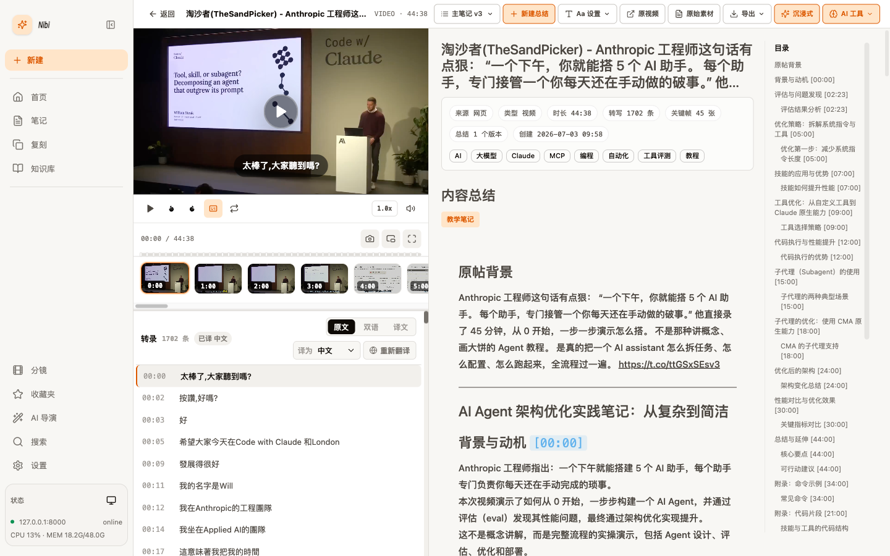
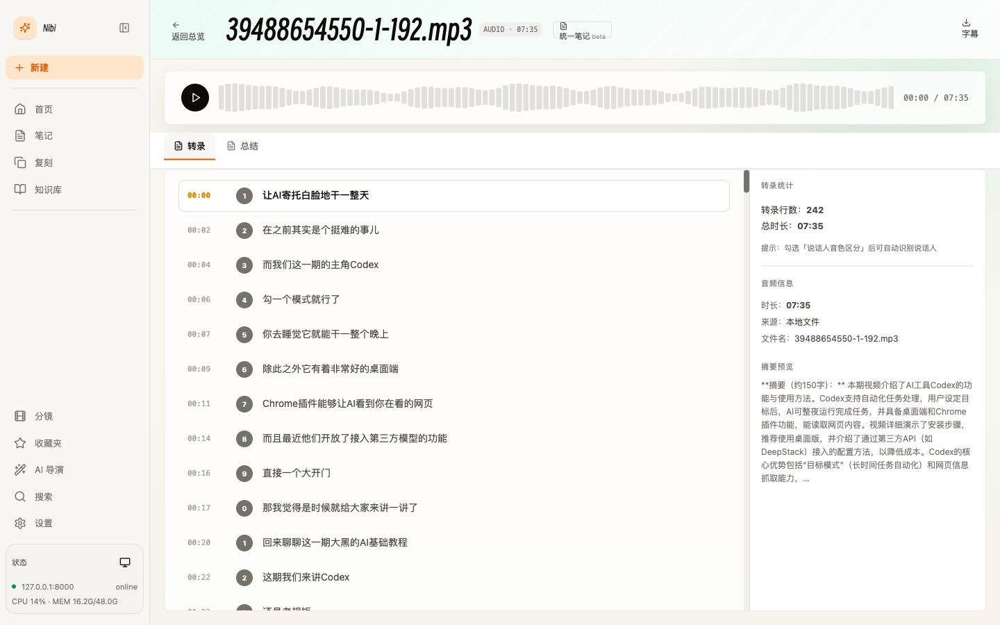
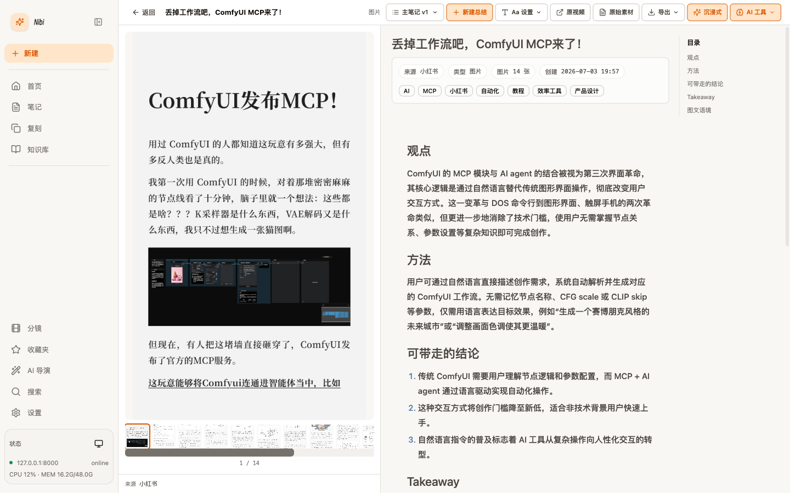
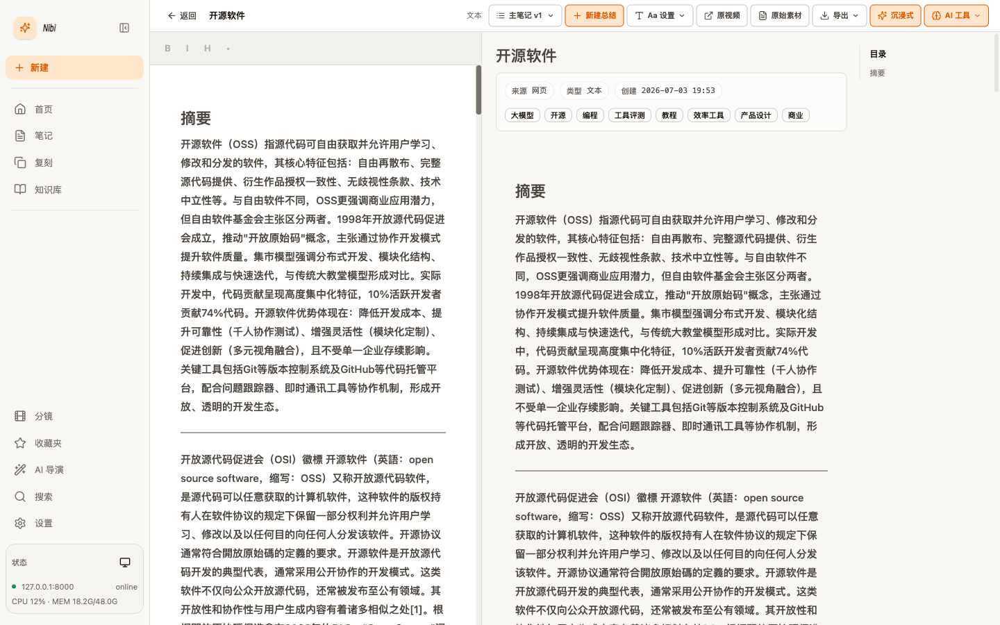
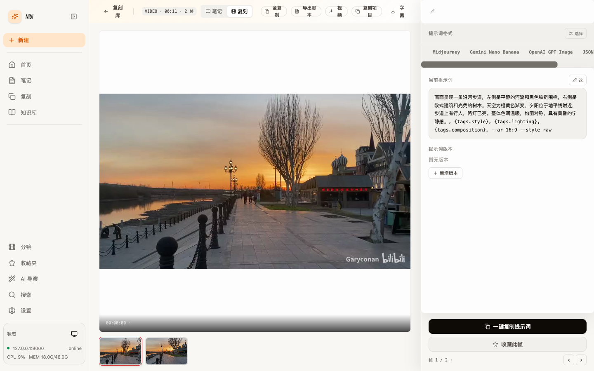
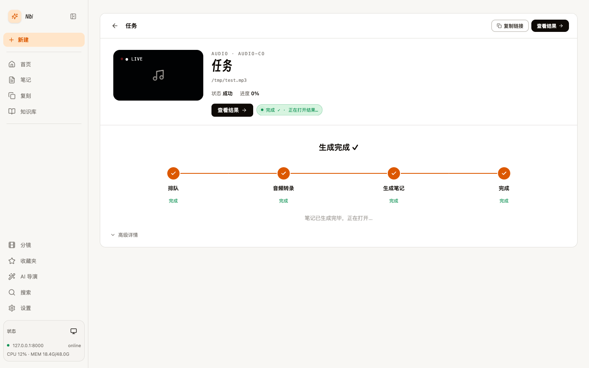

<h1 align="center">Nibi</h1>

<p align="center"><i>本地优先的 AI 多媒体笔记与创作工作台 · 把视频 / 图文 / 音频 / 文字整理成结构化笔记</i></p>

<p align="center">
  
  
  
  
  
</p>

---

## ✨ 项目简介

**Nibi** 是一个本地优先（local-first）的 AI 内容创作工具：粘贴一条视频 / 图文链接，或导入本地视频、音频、文字素材，Nibi 会自动转写、理解、并生成结构清晰的 Markdown 笔记、总结与可复刻的创作提示词。

运行时数据、模型配置、下载缓存和工作区内容**默认全部保存在本机**，不上传、不入仓。你只需自备所需的模型服务 Key，即可离线在自己的电脑上把素材沉淀成知识。

> 本项目定位为个人学习、研究与本地创作辅助工具。请遵守第三方平台条款、内容版权与所在地法律法规。

---

## 🔧 功能特性

- **多平台素材接入**：YouTube、Bilibili、抖音、小红书、X（Twitter）以及本地视频 / 音频 / 文字
- **多引擎语音转写**：MLX-Whisper（Apple Silicon）、Fast-Whisper、Groq 远程，字幕自动繁转简
- **字幕翻译**：一键翻译字幕到目标语言，结果落盘缓存
- **多模态视频理解**：ASR 转写 + 关键帧 VLM 分析 + LLM 合并总结
- **多风格总结**：内置多种总结风格模板，可编辑、可重置、保留多版本
- **结构化笔记**：自动生成带时间戳锚点、可点击跳转原片的 Markdown 笔记，支持所见即所得编辑
- **总结配图**：按占位符规则在总结中自动插入关键帧配图
- **混合笔记**：同一素材同时做视频截帧 + 图文提取 + 说话人分离
- **本地知识库**：把多篇笔记建成本地向量库，基于 RAG 做跨笔记 AI 问答（嵌入 / 重排模型可配置）
- **复刻提示词**：从素材反推可复用的创作提示词，卡片化展示、一键复制 / 导出
- **多格式导出**：Markdown / HTML / PDF / Word / 长图 / PPTX / Obsidian
- **多模型供应商**：SiliconFlow、Anthropic、OpenAI 兼容接口，供应商与默认模型可自由配置

---

## 📸 界面预览

### 🎬 视频笔记结果页

左侧视频播放器 + 关键帧时间轴 + 逐句转写（可切原文 / 双语 / 译文），中间结构化笔记正文（带时间戳锚点、可点击跳转原片），右侧自动生成的目录导航。



### 🎧 音频笔记结果页

波形播放器 + 逐句时间戳转写，右侧转录统计、音频信息与摘要预览；勾选「说话人音色区分」后可自动识别说话人。



### 🖼 图文笔记结果页（小红书 / X）

左侧原帖图集逐张浏览，右侧把图文内容提炼成「观点 / 方法 / 可带走的结论」等结构化笔记，并自动打标签。



### 📝 文本笔记结果页

左侧可编辑源文本，中间生成带标签的摘要与结构化笔记，右侧目录导航。



### 🎨 复刻提示词页

从画面帧反推可复用的创作提示词，支持 Midjourney / Gemini / GPT Image / JSON 多种格式，一键复制或导出脚本。



### ⏳ 处理流程

添加素材后走「排队 → 转写 → 生成笔记 → 完成」的可视化流水线，实时进度可查。



---

## 🧱 技术栈

| 层 | 技术 |
|---|---|
| 前端 | React 19 · TypeScript · Vite 6 · Tailwind 4 |
| 后端 | Python 3.11 · FastAPI · SQLAlchemy · SQLite |
| 转写 | MLX-Whisper · Fast-Whisper · Groq |
| 下载 | yt-dlp · ffmpeg |
| 知识库 | faiss 向量检索 + 可配置嵌入 / 重排模型 |

---

## 🚀 快速开始

> 环境要求：macOS（启动脚本以 macOS 为主，依赖 Homebrew）、Python 3.11+、Node 18+、ffmpeg。首次启动脚本会自动检测并协助安装缺失依赖。Linux 用户可参照脚本手动安装依赖后单独启动前后端。

```bash
# 1. 首次启动（自动检测/安装依赖、创建 .venv、装前后端依赖）
./start.sh

# 日常开发快速启动
./dev.sh

# 2. 浏览器打开
open http://localhost:5177
```

启动脚本会自动：

- 检测 / 安装 Homebrew、Python 3.11+、ffmpeg、Node、pnpm
- 创建 `.venv` 并安装 `requirements.txt`
- 并行启动 FastAPI 后端（默认 `8000`）+ Vite 前端（默认 `5177`）

首次使用请到 **设置页** 配置模型供应商与 API Key（也可在项目根拷贝 `local_settings.example.py` 为 `local_settings.py` 填写）。

---

## ⚙️ 依赖说明

### 🎬 FFmpeg

音视频转码依赖 FFmpeg，需单独安装：

```bash
# macOS (brew)
brew install ffmpeg

# Ubuntu / Debian
sudo apt update && sudo apt install -y ffmpeg

# Windows
# 请从官网下载安装：https://ffmpeg.org/download.html
```

### 🗣 语音转写引擎

- **Apple Silicon (M 系列)**：默认走 MLX-Whisper，本地推理最快
- **其它平台 / CPU**：可用 Fast-Whisper（首启自动下载模型）
- **不想本地跑**：配置 `GROQ_API_KEY` 走远程转写

---

## 🔑 环境变量

| 变量 | 默认值 | 说明 |
|------|--------|------|
| `BACKEND_PORT` | `8000` | 后端端口 |
| `VITE_PORT` | `5177` | 前端端口 |
| `SILICONFLOW_API_KEY` | - | SiliconFlow API Key（模型调用） |
| `ANTHROPIC_API_KEY` | - | 可选，使用 Anthropic 模型时填写 |
| `GROQ_API_KEY` | - | 可选，使用远程 ASR 时填写 |

> 复制 `.env.example` 为 `.env` 后按需修改；不要把真实 Key 提交进仓库。

---

## 📁 目录结构

```
.
├── backend/     FastAPI 任务中心与 Provider / Pipeline / Transcript / RAG 路由
├── frontend/    React 19 + Vite 6 前端（唯一入口）
├── shared/      前后端共享：配置、Provider、工具（knowledge_base、转写路由等）
├── src/         vidmirror 核心 Provider 抽象
├── scripts/     运行前自检、清理脚本
├── tests/       后端与前端单测
└── docs/        公开文档（规格、工作流、发布清单等）
```

---

## 🛠 开发指南

```bash
# 单独启动（调试用）
uvicorn backend.app.main:app --reload --port 8000   # 后端
cd frontend && pnpm dev                              # 前端

# 测试
pytest tests/backend -q          # 后端
cd frontend && pnpm lint         # 前端 ESLint
cd frontend && pnpm build        # tsc -b && vite build

# 启动前自检
python3 scripts/preflight_check.py
```

任务日志流式接口：

- `GET /pipeline/tasks/{task_id}/events`（Server-Sent Events）
- `WebSocket /pipeline/tasks/{task_id}/ws`

贡献流程见 [CONTRIBUTING.md](CONTRIBUTING.md)，安全问题见 [SECURITY.md](SECURITY.md)。

---

## 🧠 Roadmap

- [x] 多平台笔记（YouTube / Bilibili / 抖音 / 小红书 / X）
- [x] 多引擎语音转写 + 繁转简
- [x] 字幕翻译（落盘缓存）
- [x] 多风格总结 + 时间戳锚点笔记
- [x] 本地知识库 RAG 问答
- [x] 多格式导出（含 PDF / Word / Obsidian）
- [ ] 更多平台与更完善的桌面端体验

---

## 🔎 代码参考 / 致谢

- 产品形态与交互深受开源项目 [BiliNote](https://github.com/JefferyHcool/BiliNote) 启发，特此致谢。
- 视频下载基于 [yt-dlp](https://github.com/yt-dlp/yt-dlp)，语音转写基于 [MLX-Whisper](https://github.com/ml-explore/mlx-examples) / [faster-whisper](https://github.com/SYSTRAN/faster-whisper)。

---

## 📜 License

[MIT](LICENSE)

---

## ⭐ Star History

[](https://www.star-history.com/#garyconan1224/nibi&Date)
