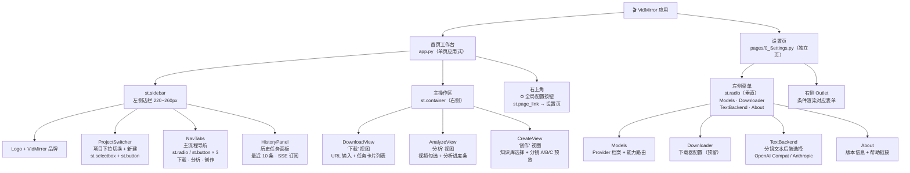

# VidMirror — UI 线框图与布局规范（Phase 2.1）

> 状态：**待用户确认**，确认后进入 Phase 2.2 编码
> 生成时间：2026-04-18
> 对应重构计划：`REFACTOR_PLAN.md` § 三 Phase 2

---

## 一、目标态信息架构图



---

## 二、三栏布局 ASCII 线框图

主工作台（`app.py`）页面整体布局，参考 BiliNote `HomeLayout`：

```
┌─────────────────────────────────────────────────────────────────────────────┐
│  Browser / Streamlit Window                                      [⚙️ 设置]  │
├───────────────────────┬─────────────────────────────────────────────────────┤
│  st.sidebar           │  主操作区  st.container（layout="wide" 右侧剩余宽度） │
│  ≈ 220 ~ 260 px       │                                                     │
│  ───────────────────  │  ┌──────── st.columns([2, 5]) ──────────────────┐  │
│  🎬 VidMirror         │  │ 左分栏 [2]       │ 右主栏 [5]                │  │
│                       │  │ ≈ 28% 宽度       │ ≈ 72% 宽度                │  │
│  ─── 项目切换 ───     │  │                  │                            │  │
│  st.selectbox         │  │  （预留扩展区）   │  DownloadView             │  │
│  [新建项目名]         │  │  或合并为单列     │    st.form("download")    │  │
│  [新建并切换]         │  │                  │    st.text_input(URL)     │  │
│                       │  │                  │    st.selectbox(browser)  │  │
│  ─── 主流程导航 ───   │  │                  │    st.form_submit_button  │  │
│  st.radio / button：  │  │                  │    ────────────────────── │  │
│  ● 下载               │  │                  │    任务卡片列表            │  │
│  ○ 分析               │  │                  │    st.container(border=T) │  │
│  ○ 创作               │  │                  │    st.progress(...)       │  │
│                       │  │                  │                            │  │
│  ─── 历史任务 ────    │  │                  │  AnalyzeView（按需渲染）  │  │
│  HistoryPanel         │  │                  │    视频勾选 st.checkbox   │  │
│  最近 10 条           │  │                  │    st.button("开始分析")  │  │
│  st.expander × N      │  │                  │    st.progress(进度)      │  │
│  每 3s 轮询刷新       │  │                  │                            │  │
│                       │  │                  │  CreateView（按需渲染）   │  │
│                       │  │                  │    st.selectbox(知识库)   │  │
│                       │  │                  │    st.button("加载知识库")│  │
│                       │  │                  │    st.tabs([A][B][C])     │  │
│                       │  │                  │    st.markdown(分镜内容)  │  │
│                       │  └──────────────────┴────────────────────────────┘  │
└───────────────────────┴─────────────────────────────────────────────────────┘

组件注释：
  st.sidebar              → Streamlit 原生侧边栏（固定宽度，跟随页面滚动）
  st.columns([2, 5])      → 中右分栏比例（可选，若主操作区内容宽度足够可省略左分栏）
  session_state["view"]   → 控制 DownloadView / AnalyzeView / CreateView 三者的条件渲染
  ⚙️ 全局配置按钮         → st.page_link("pages/0_Settings.py", label="⚙️ 系统设置")
                            放在 st.sidebar 底部或页面右上角（用 st.columns 推到右侧）
```

---

## 三、状态流转表

`session_state["view"]` 驱动主操作区条件渲染：

| `session_state["view"]` 值 | 渲染的视图组件 | 对应现状页面 | 触发方式 |
|---|---|---|---|
| `"download"` | `DownloadView` | `pages/1_视频下载.py` | 侧边栏点击「下载」；默认值 |
| `"analyze"` | `AnalyzeView` | `pages/2_视频分析.py` | 侧边栏点击「分析」 |
| `"create"` | `CreateView` | `pages/3_AI导演编剧工作台.py` | 侧边栏点击「创作」 |

补充说明：

- **默认值**：用户首次进入 `app.py` 时 `session_state["view"]` 初始化为 `"download"`
- **跨视图保持**：切换视图不清除其他视图的 session_state（各视图 key 已命名空间隔离，见 `src/vidmirror/ui/session_keys.py`）
- **设置页**：不走 `session_state["view"]`，仍由 Streamlit 多页面路由 `pages/0_Settings.py` 独立托管；从主页 `st.page_link` 跳入，浏览器回退可返回主页不丢 session

---

## 四、Streamlit 映射决策

原始映射表来自 `REFACTOR_PLAN.md` §三 Phase 2，本列「本项目选型」为新增：

| BiliNote 组件 | Streamlit 替代方案 | 本项目选型 | 选型理由 |
|---|---|---|---|
| `HashRouter + Routes` | `app.py` 单页 + `st.session_state["view"]` 条件渲染；设置走 `pages/` | ✅ **采用** | 与现有 Streamlit 多页面机制兼容，无需引入 JS 路由 |
| `react-resizable-panels` 三栏 | `st.sidebar`（左固定）+ `st.columns([2, 5])`（中右） | ✅ **采用 st.sidebar**（见下） | 详见「侧边栏 vs 自建列」决策 |
| `useTaskStore`（Zustand） | `st.session_state["tasks"]`（列表）+ 后端 SSE 拉取 | ✅ **采用** | 复用现有 `DOWNLOAD_BACKEND_TASK_IDS_KEY` 等键的设计模式 |
| `useTaskPolling(3000)` 每 3s 轮询 | `st.experimental_fragment(run_every="3s")` 或 `streamlit_autorefresh` | ✅ **推荐 `st.experimental_fragment(run_every=...)`** | 详见「轮询方案」决策 |
| `MarkdownViewer` | `st.markdown(..., unsafe_allow_html=True)` | ✅ **采用** | 现有页面已大量使用，无学习成本 |
| `StepBar`（状态机步骤条） | `st.progress` + `st.status` 块 | ✅ **采用**（Phase 3.1 实现 `step_bar.py`） | `st.status` 在 Streamlit ≥1.28 原生支持，适合分步展示 |
| `shadcn/ui Form + zod` 表单验证 | `st.form` + pydantic 手动校验 | ✅ **采用** | 现有页面已有 `st.form`，pydantic 已在后端 models 中使用 |

### 关键决策详解

#### 决策 A：轮询方案选型

**选型**：`st.experimental_fragment(run_every="3s")`

**理由**：
- `streamlit_autorefresh` 是第三方包，会刷新整个页面，导致全量 rerun 和 session_state 清空风险
- `st.experimental_fragment(run_every=...)` 是 Streamlit 官方方案（≥1.33 正式化为 `st.fragment`），只刷新被装饰的函数区块，**不触发全页 rerun**，与 `HistoryPanel` 局部更新语义完全匹配
- 现有后端 SSE 端点 `GET /pipeline/tasks/{id}/events` 已存在，`fragment` 内部可直接用 HTTP 轮询替代长连接，实现成本低

#### 决策 B：st.sidebar vs 自建 st.columns[0]

**选型**：`st.sidebar`（Streamlit 原生侧边栏）

**理由**：
- `st.sidebar` 提供固定宽度、可折叠（移动端）、天然与主内容区分离等能力，无需手写 CSS
- `st.columns` 的第 0 列会随页面内容高度撑开，无法做到"侧边栏始终跟随滚动"效果
- 现有 `pages/1_视频下载.py` / `pages/2_视频分析.py` / `pages/3_AI导演编剧工作台.py` 均已使用 `st.sidebar`，迁移路径清晰，不引入新模式
- BiliNote 左栏 18% + 中栏 16% 的两个 aside 面板在 Streamlit 中可统一折叠进 `st.sidebar`，右侧主栏用 `st.columns([2, 5])` 可选择性进一步分隔

#### 决策 C：设置页菜单结构

**选型**：`pages/0_Settings.py` 内用 `st.radio`（垂直，`horizontal=False`）模拟左侧菜单，右侧用 `if menu == "Models":` 条件渲染对应表单区块

**理由**：
- 对应 BiliNote `SettingLayout.tsx` 的左菜单（300px 固定）+ 右侧 `<Outlet />` 嵌套路由结构
- 现有 `pages/0_系统设置.py` 已有四个逻辑区块（Provider 档案、能力路由、文本后端、测试报告），只需将其拆分为 4 个菜单项（Models / Downloader / TextBackend / About）并加 `st.radio` 切换，**改动面小，不需要重写业务逻辑**

