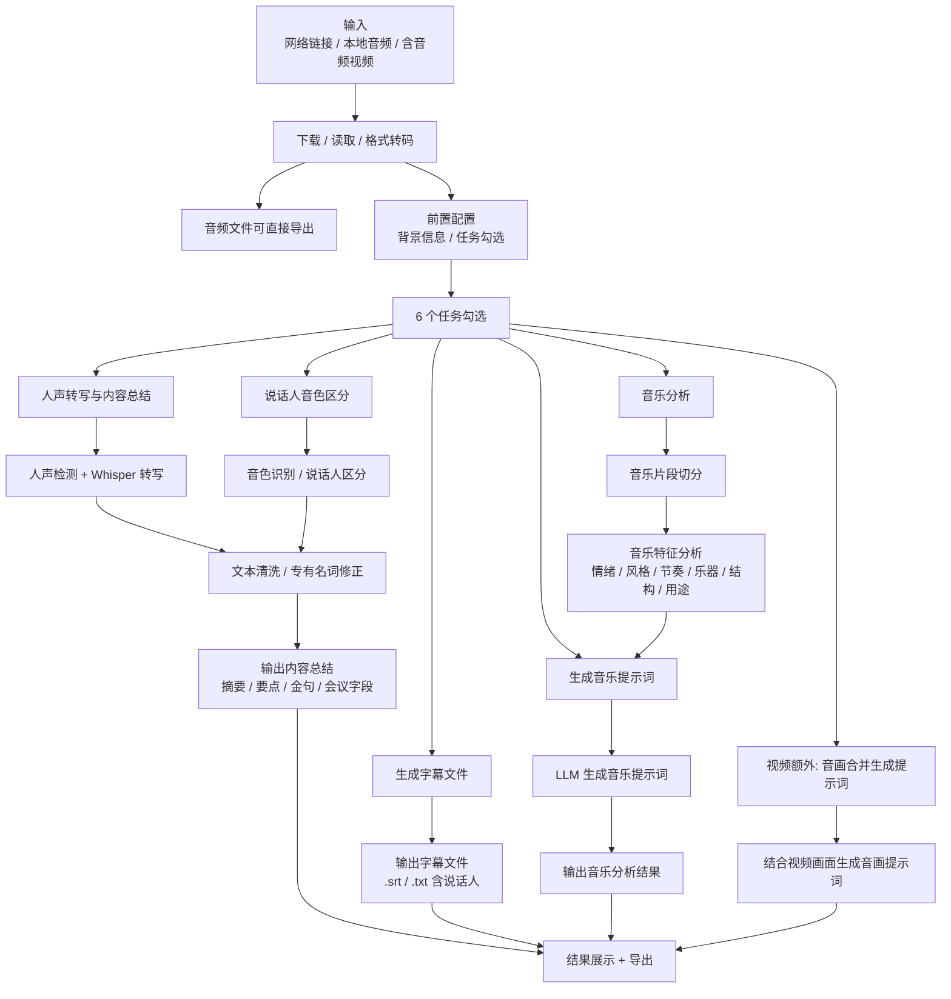

# Audio Flow Text Mirror

source_image: `docs/conversation-inputs/2026-05-18-spec-merge/音频.png`
image_size: `1438x2308`
source_sha256: `fa8051445ec0a27b714945a9380741c9a13a2b6ec81d746a67f765b9b2e741e2`
last_text_sync: `2026-05-23`
read_policy: 先读本文件；需要核对勾选项视觉位置或原图文字时再读源 PNG。

## 摘要

音频分支支持网络链接、本地音频文件和含音频的视频文件。转码后直接导出音频，并按用户勾选执行 6 类任务：人声转写与内容总结、说话人音色区分、生成字幕文件、音乐分析、生成音乐提示词、音画合并提示词。核心是人声路径与音乐路径双路并行：有人声时 Whisper 转写并总结；无论是否有人声，只要勾选音乐分析都执行音乐片段切分和 6 维度特征分析。

## Mermaid

## 6 个任务勾选

| 勾选项 | 说明 |
|---|---|
| 人声转写与内容总结 | VAD/ASR 后清洗文本，再输出摘要、要点、金句或会议字段。 |
| 说话人音色区分 | 对不同说话人做音色识别、分段、命名或用户确认。 |
| 生成字幕文件 | 输出 `.srt` / `.txt`，尽量保留说话人信息。 |
| 音乐分析 | 对音乐片段做切分和特征分析；无人声时也应可单独运行。 |
| 生成音乐提示词 | 根据音乐特征生成可用于复刻的 prompt。 |
| 音画合并生成提示词 | 视频来源额外能力：结合画面和音乐生成综合提示词。 |

## 结果与导出

| 结果 | 内容 |
|---|---|
| 音频文件 | `.mp3` 等原始或转码后文件。 |
| 字幕 | `.srt` / `.txt`，可包含说话人。 |
| 总结 | `summary.md` / `summary.json`。 |
| 音乐分析 | 分段、6 维度特征、音乐提示词。 |

## 代码锚点

| 层 | 位置 |
|---|---|
| 后端任务 | `backend/app/services/pipeline_tasks.py::handle_audio_task` |
| 音频分析 | `shared/audio_analyzer.py`、`shared/audio_prompts.py` |
| 前端结果 | `frontend/src/pages/result/AudioResultPage.tsx` |
| 确认弹窗 | `frontend/src/components/workspace/MusicModeConfirmModal.tsx` |
