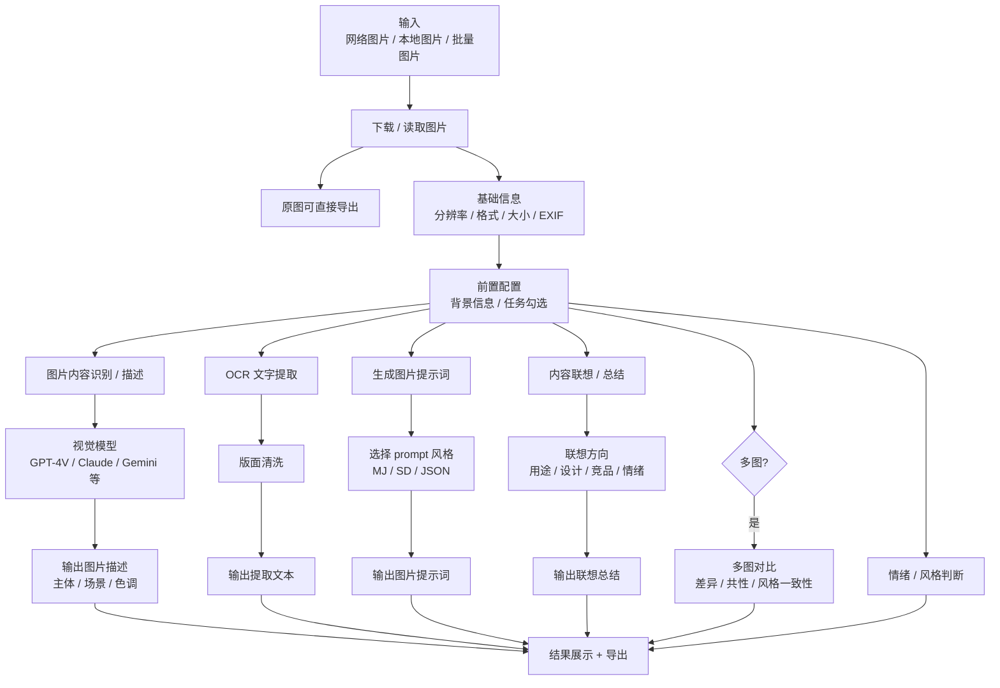

# Image Flow Text Mirror

source_image: `docs/conversation-inputs/2026-05-18-spec-merge/图片.png`
image_size: `1498x2242`
source_sha256: `3fee08f57953637d8ced1bd5ed05a23a740fbabe942913761d521c9b3bc415c9`
last_text_sync: `2026-05-23`
read_policy: 先读本文件；需要核对缩略图、EXIF 视觉排布或原图细节时再读源 PNG。

## 摘要

图片分支支持网络图片、本地图片和批量上传，先读取基础信息和 EXIF，再按用户勾选执行内容识别、OCR、图片提示词生成、联想总结、多图对比、情绪/风格判断。结果页应同时展示图片缩略图、识别描述、OCR、prompt、EXIF 与可复制/收藏动作。

## Mermaid

## 任务勾选

| 勾选项 | 输出 |
|---|---|
| 图片内容识别 / 描述 | 主体、场景、色调、构图、可能用途。 |
| OCR 文字提取 | 清洗后的文字和版面信息。 |
| 生成图片提示词 | MJ / SD / JSON 等风格 prompt。 |
| 内容联想 / 总结 | 按用途、受众、设计意图、竞品或情绪方向展开。 |
| 多图对比 | 多图共性、差异、风格一致性、表格或报告。 |
| 情绪 / 风格判断 | 风格标签、情绪标签、视觉 DNA。 |

## 结果与导出

| 区域 | 内容 |
|---|---|
| 缩略图/原图 | 左图右信息，点击可看详情。 |
| EXIF | 分辨率、格式、时间、设备、地点等；单独展示。 |
| 分析结果 | 描述、OCR、prompt、联想、对比。 |
| 动作 | 一键复制、加入收藏、导出 `.md` / `.txt` / `.json`。 |

## 代码锚点

| 层 | 位置 |
|---|---|
| 后端任务 | `backend/app/services/pipeline_tasks.py::handle_image_task` |
| 图片分析 | `shared/image_analyzer.py`、`shared/image_prompts.py` |
| 前端结果 | `frontend/src/pages/result/ImageResultPage.tsx` |
