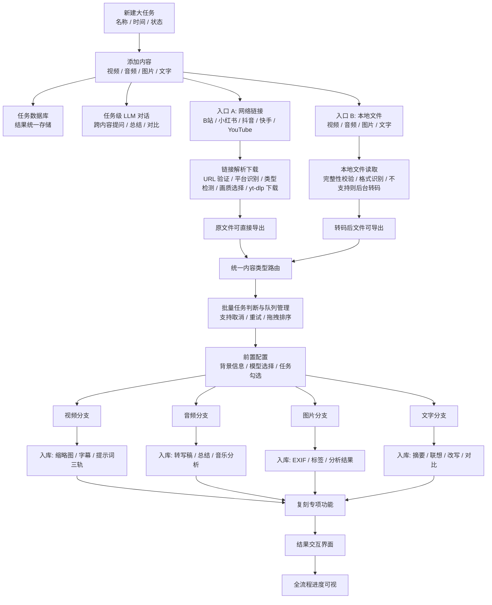

# Overall Flow Text Mirror

source_image: `docs/conversation-inputs/2026-05-18-spec-merge/流程全.png`
image_size: `1414x6050`
source_sha256: `6545d3a9b11615fe02e06c24f6128269b920ee763d8f37c10d0b4370898bd56c`
last_text_sync: `2026-05-23`
read_policy: 先读本文件；只有要核对视觉布局或本文件过期时才读取源 PNG。

## 摘要

完整系统分 7 个区域：任务系统、输入层、前置配置、四大分析分支、复刻专项功能、结果交互界面、全流程进度可视。主线是本地优先的个人工具：用户创建任务，添加多类型内容，系统按内容类型路由到视频/音频/图片/文字模块，结果统一入库，并支持任务级 LLM 跨内容提问、总结和对比。

## Mermaid

## 关键区域

| 区域 | 要点 |
|---|---|
| 任务系统 | 新建大任务；添加视频/音频/图/文多类型内容；任务数据库统一存储结果；任务级 LLM 支持跨内容提问、总结、对比。 |
| 输入层 | 网络链接与本地文件双入口；链接需平台识别和下载；本地文件需完整性校验、magic bytes 格式识别、不支持格式后台自动转码。 |
| 队列 | 单任务可直接进入；批量内容进入队列；支持取消、重试、拖拽排序。 |
| 前置配置 | 填背景信息；选择视觉/文本/视频模型；执行前按模块勾选任务，未勾选项跳过。 |
| 四大分支 | 视频、音频、图片、文字分别执行，对应分支详见 `video.md` / `audio.md` / `image.md` / `text.md`。 |
| 复刻专项 | 提示词标签库、风格提取报告、参考帧收藏夹、提示词版本记录、生成结果对比原作、复刻工作包导出。 |
| 结果交互 | 图片详情左原图右信息；视频内嵌播放器 + 三轨时间轴；音频波形 + 字幕滚动 + 说话人标签；文字原文与分析结果对照。 |
| 进度 | 下载 -> 转码 -> 截帧/转写 -> 视觉/LLM 分析 -> 后处理 -> 入库 -> 完成；显示状态、耗时、预计剩余时间；批量队列有全局面板。 |

## 异常处理

| 场景 | 处理 |
|---|---|
| 链接失败 | 提示重试；平台不支持时尝试通用抓取。 |
| 文件损坏 | 提示重新上传。 |
| 格式不支持 | 自动转码，转码后文件可导出。 |
| 批量任务 | 独立进度、失败不阻断其他任务。 |
