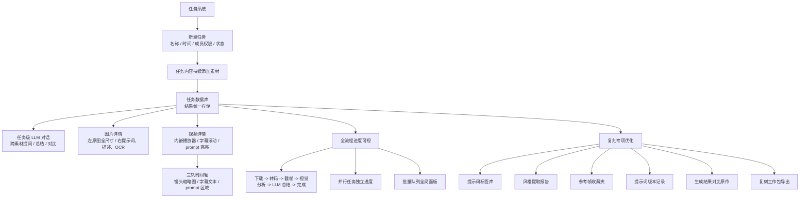

# Remix Flow Text Mirror

source_image: `docs/conversation-inputs/2026-05-18-spec-merge/场景复刻.png`
image_size: `1312x1750`
source_sha256: `ca2dae2020abb070913ff180f4a668091043d8e5b3e2582c69c3908937d7cdea`
last_text_sync: `2026-05-23`
read_policy: 先读本文件；源 PNG 底部第 4 区域在截图中被截断，若要做该区视觉还需回看设计稿 `docs/design/components/director.jsx`。

## 摘要

复刻路径是 [C] AI 导演方向的产品依据。它要求任务系统能持续添加素材、统一存储结果，并支持任务级 LLM 针对多素材提问、整合、比较。结果页需要支持图片详情、视频播放器和三轨时间轴。全流程进度必须每步可见，批量任务独立显示状态。

## Mermaid

## 任务系统要求

| 能力 | 说明 |
|---|---|
| 新建任务 | 任务包含名称、时间、成员权限、状态。 |
| 持续添加素材 | 同一个任务中可不断加入视频、图片、音频、文字。 |
| 统一存储 | 所有分析结果进入任务数据库。 |
| 任务级 LLM | 支持“这些视频的共同画风词是什么”“整合所有音乐分析”等跨素材问题。 |

## 结果交互要求

| 内容类型 | 交互 |
|---|---|
| 图片 | 点击详情；左侧原图全尺寸；右侧显示 prompt、描述、OCR；支持复制 prompt。 |
| 视频 | 内嵌播放器；字幕随播放滚动；prompt 高亮；点击时间轴跳转。 |
| 三轨时间轴 | shot 缩略图、字幕文本、prompt 高亮区域同步展示。 |
| 音频 | 波形图、字幕滚动、说话人标签。 |
| 文字 | 原文与分析结果对照展示。 |

## 进度要求

| 进度 | 说明 |
|---|---|
| 步骤条 | 下载、转码、截帧、视觉分析、LLM 总结、完成，每步显示耗时和百分比。 |
| 并行任务 | 各任务独立进度条和状态。 |
| 批量队列 | 全局面板展示等待、运行、完成、失败。 |

## 复刻专项功能

| 功能 | 说明 |
|---|---|
| 提示词标签库 | 自动 + 手动双模式，按 7 个维度归类。 |
| 风格提取报告 | 手动 + 自动触发，达到阈值后自动生成。 |
| 参考帧收藏夹 | 视频/图片随时收藏，聚合成复刻清单。 |
| 提示词版本记录 | v1 -> v2 -> v3 迭代，支持回退、对比、复用。 |
| 生成结果对比原作 | 前置选精度 3 档，对比风格、构图、像素。 |
| 复刻工作包导出 | 一键打包 `.zip`，仅本地不分享。 |

## 代码锚点

| 层 | 位置 |
|---|---|
| 分镜/复刻基础 | `shared/storyboard_generator.py` |
| 前端分镜页 | `frontend/src/pages/storyboard/StoryboardPage/index.tsx` |
| 设计稿 | `docs/design/components/director.jsx` |
