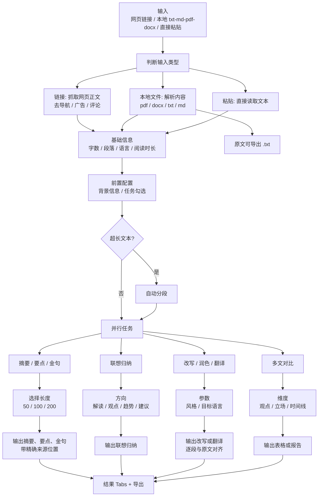

# Text Flow Text Mirror

source_image: `docs/conversation-inputs/2026-05-18-spec-merge/文字.png`
image_size: `1454x2826`
source_sha256: `accb7e6ff48cc5498836d50e50d019e93d2217e51c4e392d779ceab97758dfb8`
last_text_sync: `2026-05-23`
read_policy: 先读本文件；需要核对原流程图视觉或文字缺口时再读源 PNG。

## 摘要

文字分支支持网页链接、本地文件和直接粘贴三种输入。系统先抽取正文或解析文件，生成基础信息，然后根据任务勾选执行摘要要点、联想归纳、改写润色、翻译、多文对比。长文需要自动分段，结果页采用原文与分析结果对照展示。

## Mermaid

## 输入路径

| 输入 | 处理 |
|---|---|
| 网页链接 | 抓取网页正文，移除导航、广告、评论；失败时提示。 |
| 本地文件 | 解析 `.txt` / `.md` / `.pdf` / `.docx`，原文可导出 `.txt`。 |
| 直接粘贴 | 直接读取文本。 |

## 任务勾选

| 任务 | 参数 | 输出 |
|---|---|---|
| 内容摘要 / 要点 / 金句 | 长度 50 / 100 / 200 | 摘要、要点、金句；要点 / 金句必须带可精确跳转的原文位置。 |
| 联想归纳 | 解读、观点、趋势、建议 | 深度联想总结。 |
| 改写 / 润色 | 风格选择 | 按原文段落对齐的改写文本。 |
| 翻译 | 目标语言 | 按原文段落对齐的译文。 |
| 多文对比 | 多篇文本 + 观点/立场/时间线维度 | 表格或报告。 |

## 结果与导出

| 文件 | 内容 |
|---|---|
| `original.txt` | 原文。 |
| `summary.md` | 摘要、要点、金句。 |
| `association.md` | 联想归纳。 |
| `rewrite.docx` / translation | 改写或翻译结果。 |
| `compare.json` | 多文对比结构化结果。 |

## 代码锚点

| 层 | 位置 |
|---|---|
| 后端任务 | `backend/app/services/pipeline_tasks.py::handle_text_task` |
| 文本处理 | `shared/text_analyzer.py`、`shared/web_enrich.py` |
| 前端结果 | `frontend/src/pages/result/TextResultPage.tsx` |
