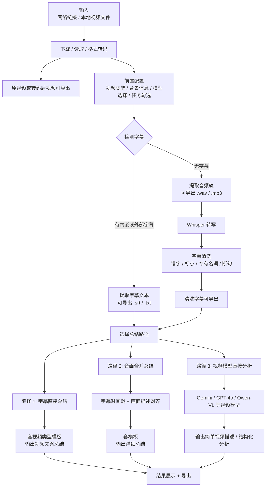

# Video Flow Text Mirror

> ⚠️ **2026-06-05**：本流程是**产品完整能力**镜像（含复刻/提示词/工具），**不等于「单素材笔记页 NoteShell」边界**（笔记≠复刻）。笔记页范围看 [`track-K-M7-result-pages-redesign.md`](../plans/track-K-M7-result-pages-redesign.md)。

source_image: `docs/conversation-inputs/2026-05-18-spec-merge/视频.png`
image_size: `1440x2598`
source_sha256: `803f6ea5030f704aaf1791298c03f9c40b03e6f63faede2dcda93c8252734a92`
last_text_sync: `2026-05-23`
read_policy: 先读本文件；需要核对图中三路径版式或模板文字时再读源 PNG。

## 摘要

视频分支从网络链接或本地视频进入，完成下载/读取/格式转码后，优先检测是否已有字幕。已有字幕走“字幕直接总结”；无字幕先提取音频并 Whisper 转写，再做字幕清洗。总结有三条路径：字幕总结、音画合并、视频模型直读。结果页按所选路径展示摘要、字幕、时间轴、画面提示词和导出入口。

## Mermaid

## 输入与配置

| 项 | 内容 |
|---|---|
| 输入 | 网络链接、本地视频文件。 |
| 前置配置 | 视频类型预设：课程、宣传片、Vlog、访谈、新闻报道、产品评测、其他。 |
| 背景信息 | 可选，用于提升转写、专有名词修正、总结准确率。 |
| 模型 | 视觉模型、文本模型、视频模型分别选择；系统不内置固定供应商。 |

## 三条总结路径

| 路径 | 触发条件 | 核心处理 | 输出 |
|---|---|---|---|
| 路径 1：字幕直接总结 | 有字幕，或无字幕但已转写出字幕 | 字幕文本清洗后套视频类型模板 | 视频文案总结、要点、章节或模板化摘要 |
| 路径 2：音画合并总结 | 需要结合画面内容 | 对齐字幕时间戳与关键帧/画面描述 | 更详细的音画综合总结 |
| 路径 3：视频模型直接分析 | 用户选择视频模型直读 | 将视频交给多模态视频模型 | 简单描述、场景/主题分析 |

## 结果与导出

| 结果区 | 内容 |
|---|---|
| 视频播放 | 内嵌播放器，支持定位。 |
| 字幕 | 原字幕或清洗字幕，可导出 `.srt` / `.txt`。 |
| 总结 | 按视频类型模板输出，可导出 `.txt` / `.md` / `.json`。 |
| 三轨时间轴 | 缩略图、字幕文本、提示词/画面重点同步展示，点击任意位置跳转。 |

## 代码锚点

| 层 | 位置 |
|---|---|
| 后端任务 | `backend/app/services/pipeline_tasks.py::handle_analyze_task` |
| 视频分析 | `shared/video_analyzer.py` |
| 前端结果 | `frontend/src/pages/result/VideoResultPage.tsx` |
| 前置配置 | `frontend/src/components/workspace/PreflightDrawer.tsx` |
