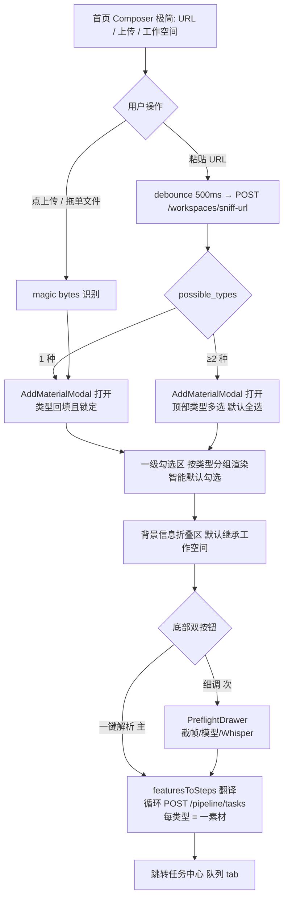

# Phase R — 首页输入层重构

## 背景与诊断

当前 `frontend/src/pages/WorkbenchPage/Composer.tsx`（630 行）把 SPEC §3.1 规定的「设置页 / 添加素材模态 / Preflight 抽屉」三层配置压成一层，首页堆了大量在未输入 URL / 未识别类型时就毫无意义的"死按钮"：

- 画质 segm（SPEC: 设置页全局默认）
- 抽帧 A/B + fps + maxFrames（SPEC: Preflight 抽屉）
- 3 个 LLM 下拉 + 提示词风格（SPEC: 默认走设置页，细调走 Preflight）
- 7 个 pipeline pill（SPEC 里根本没有"工程步骤勾选"这层 UI）

后端核实结论：
1. `/pipeline/tasks` 的 `steps` 字段只对 `task_type=="note"` 生效，且写死 `download/transcribe/analyze/note` 四个工程步骤，**没有"一级勾选项 → enabled_steps"映射**。
2. `/pipeline/tasks` **不支持批量**，批量场景前端循环 POST。
3. 背景信息 schema 基本就绪：`WorkspaceCreateRequest.background` / `PreflightSaveRequest.background_overrides` 都是 `Dict[str, Any]`，前后端约定 key 即可。

## 本期范围（重要：本期只做单链接多类型，不做多文件批量）

✅ 做：
- Composer 瘦身：删除所有"死按钮" UI，仅保留 URL 框 + 上传按钮 + 工作空间选择。
- 重写 `AddMaterialModal` 承担 SPEC §2.1「4 步合一」：类型 + 输入源 + 一级勾选 + 背景。
- 单 URL 多内容类型场景：sniff 返回 `possible_types ≥ 2` 时在模态内多选 → 前端循环 POST 一类型一素材。
- 一级勾选项 → 后端 steps 的前端翻译层 `lib/featuresToSteps.ts`。
- R3.1：点击「添加素材」后出现的二级界面改为 `/Users/conan/Downloads/vidmirror (Remix)` 的 Remix modal 风格。
- PreflightDrawer 接管细粒度参数（截帧、模型、Whisper），从模态"细调"按钮唤起。

❌ 不做（押后）：
- 多文件批量上传（拖入 ≥ 2 个本地文件）→ 先 toast 提示"暂仅支持单文件"，后续单开 phase。
- 后端 `handle_note_task` 重构 → 本期前端做翻译层，后端 payload 保持 `Dict[str, Any]` 不动。
- 设置页"分析默认偏好"页面的勾选偏好持久化 → 智能默认硬编码在前端，押后接设置页。

---

## 目标 Mermaid 流程



---

## 子任务拆分（按可独立 commit 粒度）

> 每完成一个子任务立即 commit 并通知用户。本 phase 全程在 `feat/phase-r-input-refactor` 分支上做。

### R0 准备分支（DS v4-pro，5 min）
- [ ] R0.1 `git checkout -b feat/phase-r-input-refactor`
- [ ] R0.2 把本文件 `status: ready → in_progress`，提交 `chore(phase-r): R0 启动分支与计划落地`

### R1 Composer 瘦身（DS v4-pro，30 min；单文件改动）
**目标**：删 6 块死 UI，handleRun 改为打开模态。Composer 行数从 630 → 预计 ~250。

- [ ] R1.1 删 `composer-quality` 区块（画质 + 抽帧 A/B + fps + maxFrames 输入框）
- [ ] R1.2 删 `composer-options` 区块（ASR / 视觉 / 文本 / 提示词风格 4 列）
- [ ] R1.3 删 `composer-pipeline` 区块（7 个 pipeline pill）
- [ ] R1.4 删 `composer-run` meta 区块的"预计 ~ 4 min"和 metaText
- [ ] R1.5 `handleRun` 改名 `handleAdd`，无论单一/混合类型都唤起 `AddMaterialModal`（携带 sniffResult + 已选 workspace）
- [ ] R1.6 删除随之无引用的 state：`steps / quality / frameMode / fps / maxFrames / asrModel / visionModel / textModel / promptStyle / promptFormats / mixedOpen / mixedSel / preflightOpen / preflightTypes`（其中 mixed/preflight 相关迁移到模态内部）
- [ ] R1.7 删除随之无引用的 import：`PipelineStep / QualityOption / FrameMode / QUALITY_OPTS / PIPE_STEPS / STEP_ICONS / getPromptFormatsConfig / useProviderStore / MixedContentModal / PreflightDrawer` 等
- [ ] R1.8 跑 `cd frontend && pnpm build` 确保过编译
- [ ] commit: `refactor(phase-r): R1 Composer 瘦身,删除6块死UI`

**DS 做不到的兜底**：若 TypeScript 报错涉及类型推断 / props 变更连锁影响 Workbench 父组件 → 升 Sonnet 4.6。

### R2 AddMaterialModal 重写（Sonnet 4.6，2-3h；中等复杂多文件）
**目标**：原 `AddMaterialModal` 只处理本地上传，本步把它升级为 SPEC §2.1「4 步合一」的统一入口。

- [ ] R2.1 新增 props：`sniffResult?: SniffResult | null` `urlValue?: string` `workspaceIds: string[]`
- [ ] R2.2 模态顶部加"素材类型"区：
  - 单一类型：灰底 chip + 类型名（已锁定）
  - 混合类型：checkbox 组，默认勾选 `sniff.possible_types` 全集
- [ ] R2.3 输入源区：只展示，不让改（URL 或文件名）
- [ ] R2.4 一级勾选区：按当前选定类型集合，调用 `getDefaultFeatures(type)` 拿到智能默认，分组渲染（参考 SPEC §2.6 表格）
  - 视频：画面提示词 / 文案总结 / 字幕导出 / 音乐分析
  - 音频：转写+总结 / 说话人音色 / 字幕导出 / 音乐分析
  - 图片：内容识别 / OCR / 提示词 / 联想总结
  - 文字：摘要+要点+金句 / 改写 / 翻译 / 多文对比
- [ ] R2.5 背景信息折叠区：5 字段（`industry / audience / brand / tone / keywords`），默认从所选 workspace 继承
- [ ] R2.6 底部双按钮：「一键解析」主、「细调…」次
- [ ] R2.7 删除现有 `MixedContentModal`，混合类型逻辑并入本模态
- [ ] R2.8 单元自测（`pnpm test`）+ 手动跑 1 次 B 站链接确认打开模态
- [ ] commit: `feat(phase-r): R2 AddMaterialModal 重写为4步合一统一入口`

**DS 不擅长**：本步涉及多 props 联动 + 表单状态 + 类型推断，**直接用 Sonnet**。

### R3 featuresToSteps 翻译层 + 多素材循环 POST（Sonnet 4.6，1-2h）
**目标**：模态"一键解析"按钮真正下发任务。

- [x] R3.a 新建 `frontend/src/lib/featuresToSteps.ts`，导出：
  ```ts
  type Feature = 'visual_prompt' | 'video_summary' | 'subtitle_export' | 'music_analysis' | ...
  function featuresToSteps(type: MaterialType, features: Feature[]): string[]
  function getDefaultFeatures(type: MaterialType): Feature[]
  ```
  映射规则见本文件"背景"段。
- [x] R3.b 在 `services/pipeline.ts`（如无则新建）封装 `createNoteTask(params)`，内部 POST `/pipeline/tasks`，task_type=`note`，payload 含 `url / material_type / enabled_features / background / workspace_id`。
- [x] R3.c 模态"一键解析"handler：选中类型循环调用 `createNoteTask`，每条 success 后聚合提示「已入队 N/M」。
- [x] R3.d 失败不阻断其他，最后用 toast 汇报。
- [x] R3.e 跑端到端：B 站链接勾选「视频+音频」→ 队列出现 2 条任务。
- [x] commit: `feat(phase-r): R3 features 翻译层 + 单URL多类型循环入队`

### R3.1 AddMaterialModal Remix 风格化（二级添加素材界面）
**定义**：这里的"二级页面"专指用户点击 Composer / Taskboard 的「添加素材」后出现的 `AddMaterialModal` 界面，不是 Workspace 详情页。

**目标**：在不改变 R2/R3 业务状态流的前提下，把当前 `AddMaterialModal` 从默认 Dialog 表单观感改为 `/Users/conan/Downloads/vidmirror (Remix)` 原型里的 Remix modal 风格。

**设计来源**：
- 结构参考：`/Users/conan/Downloads/vidmirror (Remix)/components/taskboard.jsx` 的 `AddMaterialModal`。
- 样式参考：`/Users/conan/Downloads/vidmirror (Remix)/VidMirror.html` 的 `Modal / type-card / task-chip` 样式块。
- 项目规范：`docs/DESIGN_SYSTEM.md` 与 `CLAUDE.md` 的 Remix Design Spec。

**实现要求**：
- [x] R3.1.1 使用 Remix modal 结构：`modal-backdrop` / `modal` / `m-head` / `m-body` / `m-section` / `m-foot`；若保留 Radix/shadcn 作为无障碍底座，外观层必须完全走 Remix class / token。
- [x] R3.1.2 顶部使用 `.eyebrow` + `.display`：标题为「添加素材」，副标题展示当前工作空间、平台和 sniff 标题。
- [x] R3.1.3 保留四段主流程：① 素材类型、② 输入源、③ 勾选分析任务、④ 背景信息；底部保留「细调…」与「一键解析」双按钮。
- [x] R3.1.4 素材类型改为 `.type-row` + `.type-card[data-active]`；混合类型用多选 active card，不再使用普通 checkbox 列表。
- [x] R3.1.5 输入源复用 Composer 语言：`.composer-url`、平台 icon、URL 只读/可输入态、`.kw` 能力提示。
- [x] R3.1.6 一级任务改为 `.task-chips` + `.task-chip[data-on]` + `.tc-box`，按素材类型分组但视觉上保持 Remix chip 风格。
- [x] R3.1.7 背景信息折叠内容用 `var(--bg-sunken)` 的凹陷面板、等宽字段标签和 token 化 pill；禁止组件内新增 hardcoded hex / rgba / border / radius / shadow。
- [x] R3.1.8 桌面宽度按 Remix 720px 模态，移动端 `max-width` 防溢出，内容超高时仅模态内部滚动。
- [x] R3.1.9 验收：`pnpm build`、`pnpm test`、targeted eslint 通过；浏览器打开添加素材后与 Remix 原型结构一致。
- [x] commit: `style(phase-r): R3.1 添加素材模态 Remix 风格化`

### R4 PreflightDrawer 接管细粒度参数（Sonnet 4.6，2h）
**目标**：模态"细调"按钮唤起 PreflightDrawer，PreflightDrawer 拿到模态的 staged config 作初值。

- [x] R4.1 PreflightDrawer props 增加 `stagedConfig: { type, features, background, workspaceId }`
- [x] R4.2 PreflightDrawer 内已有的截帧/模型/Whisper 字段保留，初值改为优先用 `stagedConfig.*` ?? 设置页默认
- [x] R4.3 PreflightDrawer 的"开始解析"也走 `createNoteTask`（与 R3 共用同一 service）
- [x] R4.4 检查 `composerDefaults` 的旧链路是否还有引用，删除残余
- [x] R4.5 跑端到端：点"细调…"→ 抽屉打开 → 改抽帧间隔 → 提交 → 队列出现任务且 payload 含新参数
- [ ] commit: `feat(phase-r): R4 PreflightDrawer 接管细粒度参数`

### R5 端到端冒烟（DS v4-pro 跑命令，1h）
**目标**：跑通 5 条真实链接确认闭环。

- [x] R5.1 `./start.sh` 起服务
- [x] R5.2 跑 `scripts/browser_smoke.py` 对 `/workbench` 验证：URL 输入 → sniff → 模态弹出 → 类型回填
- [x] R5.3 手动跑 6 条（1a B站视频 / 1b B站音频 / 2 YouTube / 3 小红书 / 4 微信 / 5 抖音）
- [x] R5.4 在 `docs/test-urls.md` 追加本次测试结果记录
- [x] R5.5 无 R2-R4 bug（FAILED均为外部平台限制）
- [x] commit: `test(phase-r): R5 端到端冒烟 6 条链接`

### R6 合并与收尾（DS v4-pro，10 min）
- [ ] R6.1 自测全绿后：本地 `git checkout main && git merge --no-ff feat/phase-r-input-refactor`
- [ ] R6.2 更新 `docs/EXECUTION_PLAN.md`：在 IP.9 段后新增 "R 输入层重构" 块，子任务全 `- [x]`
- [ ] R6.3 更新本文件 frontmatter：`status: done` + `commits` + `completed_date` + `actual_hours`
- [ ] R6.4 在 `docs/COMPLETED_WORK.md` 追加记录
- [ ] R6.5 通知用户「Phase R 完工，可考虑打 tag `v0.x.y-phase-r`」
- [ ] commit: `docs(phase-r): R6 收尾文档同步`

---

## 模型档位速查

| 子任务 | 推荐模型 | 触发升档 Opus 的情况 |
|---|---|---|
| R0 / R1 / R5 / R6 | DS v4-pro（ccswitch） | TypeScript 类型推断卡死 |
| R2 | Sonnet 4.6 | 模态状态机出现 5+ 个互相依赖状态 |
| R3 | Sonnet 4.6 | 后端 payload 校验失败需要排查 |
| R4 | Sonnet 4.6 | composerDefaults 旧链路引用超过 3 个文件 |

---

## 验收口径

- 首页 Composer 文件行数 ≤ 280。
- 未输入 URL / 未拖文件时，首页下方完全没有"画质 / 抽帧 / 模型 / pipeline pill"。
- 粘贴 B 站视频链接 → 0.5s 内模态弹出，类型多选已默认勾选「视频+音频」。
- 点「一键解析」→ 队列出现 2 条任务（视频 1 条、音频 1 条），均最终 SUCCESS。
- 点「细调…」→ PreflightDrawer 携带 staged config 打开；改截帧间隔后提交，payload 反映新值。

---

## 待用户确认的两个口子

1. **`enabled_features` 字段名**最终采用 `enabled_features`（不叫 `analysis_features` / `tasks`），后端不动 schema，前端塞进 `payload`。
2. **「音乐分析 / OCR / 联想总结」等一级项**的后端实现完成度需用户在 R5 验收时给清单，避免 R5 卡在"UI 可勾后端跑不出"。本期允许 UI 占位 + 后端报"未实现"warning，不阻断其他类型。
